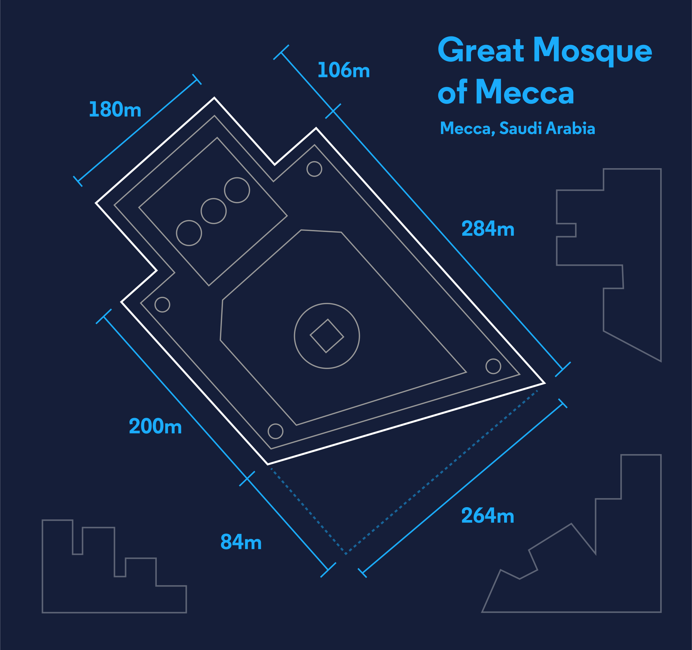

# Architect_Arithmetic
C # program to calculate materials construction costs based on the dimensions in the architect’s floor plan.
Architects have big ideas – but big ideas can be expensive. How expensive? Depends on the size.

In this program developed in .Net, I have calculated the construction costs based on the plans shown below ...

